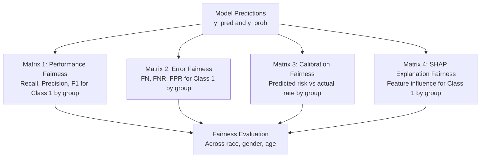
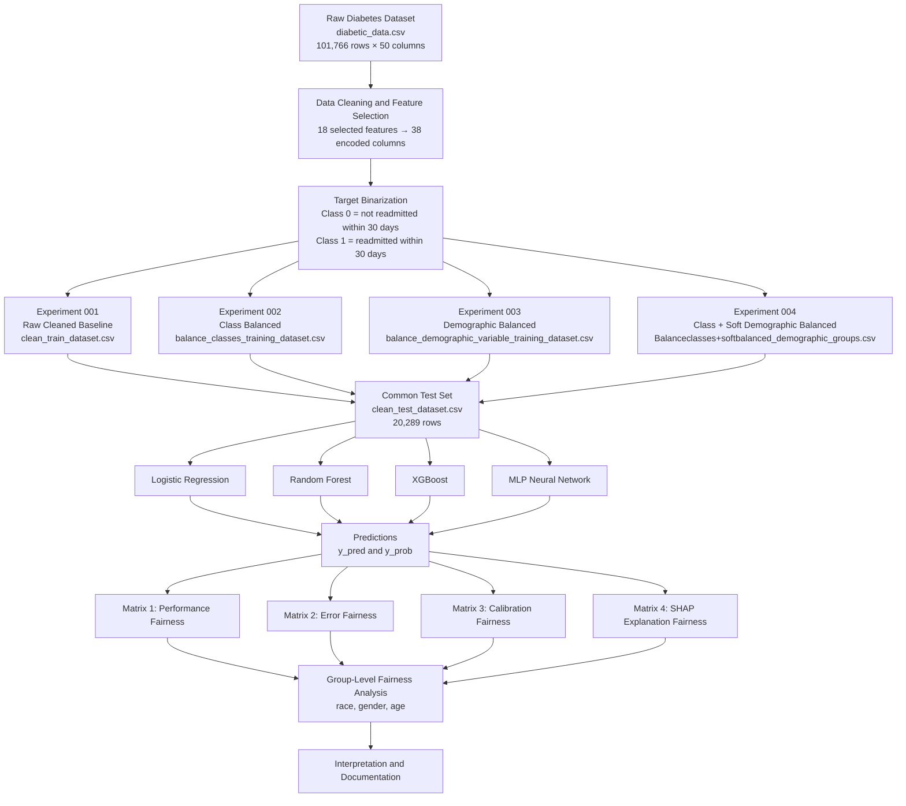
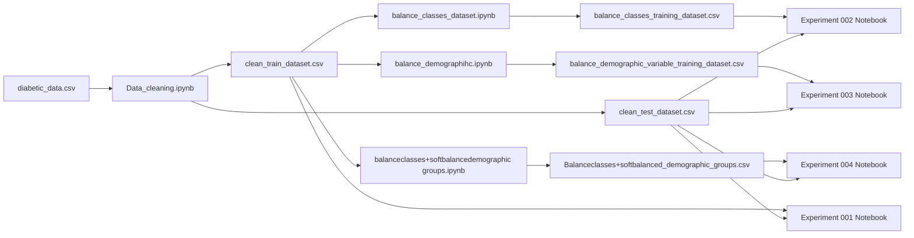

# FairCare Project Architecture and Experiment Documentation

**Project Name:** FairCare: Fairness-Aware Healthcare Readmission Prediction  
**Report Type:** Project Architecture and Experiment Documentation  
**Status:** In Progress

---

## 1. Project Overview

FairCare is a machine learning project focused on predicting whether a diabetic patient will be readmitted to the hospital within 30 days. In addition to standard model performance evaluation, FairCare incorporates a structured fairness analysis to examine how models perform across demographic groups defined by race, gender, and age.

The project is organized around four experiments, each using a different training data preparation strategy. All experiments train and evaluate the same four machine learning models and apply a consistent fairness evaluation framework referred to as the **Four-Matrix Fairness Framework**.

The primary clinical interest is in detecting patients who are readmitted within 30 days (Class 1), as this group may benefit from targeted post-discharge interventions.

---

## 2. Dataset Overview

FairCare uses the publicly available **UCI Diabetes 130-US Hospitals** dataset, which contains clinical records from 130 US hospitals collected between 1999 and 2008.

| Property | Value |
|---|---|
| File name | `diabetic_data.csv` |
| Total rows | 101,766 |
| Total columns | 50 |
| Target column | `readmitted` |
| Original target values | `NO`, `>30`, `<30` |

### Original Target Distribution

| Value | Count | Percentage |
|---|---:|---:|
| NO | 54,864 | 53.91% |
| >30 | 35,545 | 34.93% |
| <30 | 11,357 | 11.16% |

The dataset includes patient demographics, admission details, medication records, lab test results, and diagnosis codes. From the original 50 columns, 18 features were selected for use in the FairCare experiments.

---

## 3. Selected Features

FairCare uses the following **18 features**, organized into five groups:

### Prior Visit Features

| Feature | Simple Meaning |
|---|---|
| `number_inpatient` | Number of inpatient visits in the preceding year |
| `number_emergency` | Number of emergency visits in the preceding year |
| `number_outpatient` | Number of outpatient visits in the preceding year |

These features capture the patient's recent healthcare utilization history.

### Hospital Stay / Admission Features

| Feature | Simple Meaning |
|---|---|
| `time_in_hospital` | Number of days the patient spent in the hospital |
| `admission_type_id` | How the patient was admitted (e.g., emergency, urgent, elective) |
| `discharge_disposition_id` | Where the patient went after discharge (e.g., home, nursing facility) |

These features describe the current hospital encounter.

### Medication and Lab Features

| Feature | Simple Meaning |
|---|---|
| `num_medications` | Number of distinct medications prescribed |
| `num_lab_procedures` | Number of lab tests performed during the stay |
| `diabetesMed` | Whether any diabetes medication was prescribed (Yes / No) |
| `insulin` | Insulin dosage status (No, Steady, Up, Down) |
| `metformin` | Metformin dosage status (No, Steady, Up, Down) |
| `max_glu_serum` | Glucose serum test result (None, Norm, >200, >300) |
| `A1Cresult` | Hemoglobin A1C test result (None, Norm, >7, >8) |

These features reflect medication use and laboratory measurements relevant to diabetes management.

### Diagnosis Features

| Feature | Simple Meaning |
|---|---|
| `diag_1` | Primary diagnosis (ICD-9 code) |
| `diag_2` | Secondary diagnosis (ICD-9 code) |

Diagnosis codes describe the patient's medical conditions for the current encounter.

### Demographic Features

| Feature | Simple Meaning |
|---|---|
| `race` | Patient's self-reported race/ethnicity |
| `age` | Patient's age group as 10-year intervals (e.g., `[70-80)`) |
| `gender` | Patient's gender (Female, Male) |

Demographic features serve two roles in FairCare:
1. They are used as regular input features for model training.
2. They are used as **fairness slicing variables** to evaluate whether model performance differs across demographic subgroups.

### Feature Encoding

After data cleaning, the 18 original features are encoded into **38 model-ready columns** (plus the target column, totaling 39):

- `race` is one-hot encoded into 5 columns (`race_AfricanAmerican`, `race_Asian`, `race_Caucasian`, `race_Hispanic`, `race_Other`)
- `diag_1` and `diag_2` are each grouped into 9 ICD-9 categories (Circulatory, Diabetes, Digestive, Genitourinary, Injury, Musculoskeletal, Neoplasms, Other, Respiratory)
- `age` is mapped to integer indices 0–9 representing decile brackets
- `gender` is binary encoded (0 = Female, 1 = Male)
- Medication status columns (`insulin`, `metformin`, `diabetesMed`, `max_glu_serum`, `A1Cresult`) are ordinal encoded
- Numeric features are retained as-is

---

## 4. Target Variable and Class Meaning

The original `readmitted` column contains three values. For the FairCare experiments, these are binarized into two classes:

| Original Value | Binary Class | Meaning |
|---|---:|---|
| `<30` | 1 | Readmitted within 30 days |
| `>30` | 0 | Readmitted after 30 days (treated as not within 30 days) |
| `NO` | 0 | Not readmitted |

### Class Summary

| Class | Meaning | Role |
|---|---|---|
| Class 0 | Not readmitted within 30 days | Negative class |
| Class 1 | Readmitted within 30 days | Positive class (main focus) |

**Class 1** is the primary class of interest in FairCare. It represents patients who returned to the hospital within 30 days, a population that may benefit from additional care coordination or follow-up. The fairness analysis in this project focuses on how well each model detects Class 1 patients across demographic groups.

A **false negative** in this context means a patient who was actually readmitted within 30 days was predicted as not readmitted. This type of error is clinically relevant because it could lead to missed opportunities for post-discharge support.

---

## 5. CSV Files Used

The following data files are used in the FairCare project:

| File | Rows | Columns | Purpose |
|---|---:|---:|---|
| `diabetic_data.csv` | 101,766 | 50 | Raw original dataset |
| `clean_train_dataset.csv` | 81,474 | 39 | Cleaned training set for Experiment 001 |
| `clean_test_dataset.csv` | 20,289 | 39 | Common test set used across all experiments |
| `balance_classes_training_dataset.csv` | 18,376 | 39 | Class-balanced training set for Experiment 002 |
| `balance_demographic_variable_training_dataset.csv` | 33,390 | 39 | Demographic-balanced training set for Experiment 003 |
| `Balanceclasses+softbalanced_demographic_groups.csv` | 7,568 | 39 | Class + soft demographic balanced training set for Experiment 004 |
| `train_data.csv` | — | — | Intermediate file from the data pipeline |
| `test_data.csv` | — | — | Intermediate file from the data pipeline |
| `IDS_mapping.csv` | — | — | Reference mapping for admission_type_id, discharge_disposition_id, and admission_source_id |

All four experiments share `clean_test_dataset.csv` as the common held-out test set. This design ensures that model performance and fairness metrics are comparable across experiments.

### Test Set Class Distribution

| Class | Count | Percentage |
|---|---:|---:|
| Class 0 | 18,120 | 89.31% |
| Class 1 | 2,169 | 10.69% |

---

## 6. Four Experiment Design

FairCare includes four experiments, each using a different training data preparation strategy. The test set remains the same across all experiments.

| Experiment | Training Dataset | Training Rows | Strategy | Research Question |
|---|---|---:|---|---|
| 001 | `clean_train_dataset.csv` | 81,474 | Raw cleaned baseline | How do models perform without any balancing? |
| 002 | `balance_classes_training_dataset.csv` | 18,376 | Class balancing | Does balancing Class 0 and Class 1 improve readmission detection? |
| 003 | `balance_demographic_variable_training_dataset.csv` | 33,390 | Demographic balancing only | Does demographic balancing alone affect fairness or detection? |
| 004 | `Balanceclasses+softbalanced_demographic_groups.csv` | 7,568 | Class + soft demographic balancing | Does combining class and demographic balancing affect both detection and fairness? |

### Training Set Target Distribution by Experiment

| Experiment | Class 0 | Class 1 | Class 0 % | Class 1 % |
|---|---:|---:|---:|---:|
| 001 | 72,286 | 9,188 | 88.73% | 11.27% |
| 002 | 9,188 | 9,188 | 50.00% | 50.00% |
| 003 | 29,606 | 3,784 | 88.67% | 11.33% |
| 004 | 3,784 | 3,784 | 50.00% | 50.00% |

Experiments 002 and 004 use class-balanced training data (equal Class 0 and Class 1 counts). Experiments 001 and 003 retain the original class imbalance.

---

## 7. Model Architecture

Each experiment trains and evaluates four machine learning models:

| Model | Type | Notes |
|---|---|---|
| Logistic Regression | Linear classifier | Trained on standardized (scaled) features; `max_iter=1000` |
| Random Forest | Ensemble tree classifier | Trained on unscaled features; `n_estimators=200`, `class_weight='balanced'` |
| XGBoost | Gradient-boosted tree classifier | Trained on unscaled features; `n_estimators=200` |
| MLP Neural Network | Feedforward neural network | Trained on standardized (scaled) features |

Each model produces:
- `y_pred`: Predicted class label (0 or 1)
- `y_prob`: Predicted probability of Class 1

Both outputs are used in the fairness evaluation. `y_pred` is used for classification metrics and confusion matrix computation. `y_prob` is used for ROC-AUC, calibration analysis, and risk assessment.

---

## 8. FairCare Four-Matrix Fairness Framework

FairCare evaluates each model using four fairness matrices. Each matrix examines model behavior across demographic subgroups (race, gender, age) with a focus on Class 1 (readmitted within 30 days).

### Matrix 1: Performance Fairness Matrix

**What it measures:** Standard classification metrics for Class 1 broken down by demographic group.

| Metric | What It Answers |
|---|---|
| Recall (Class 1) | Of all patients actually readmitted in this group, how many did the model correctly identify? |
| Precision (Class 1) | Of all patients the model flagged as readmitted in this group, how many were actually readmitted? |
| F1-Score (Class 1) | Harmonic mean of Precision and Recall for Class 1 |
| ROC-AUC | How well does the model distinguish between Class 0 and Class 1 for this group? |

**Why it matters:** If Recall for Class 1 varies significantly across demographic groups, it indicates that the model detects readmissions more reliably for some populations than others.

### Matrix 2: Error Fairness Matrix

**What it measures:** The distribution of model errors across demographic groups, with emphasis on false negatives.

| Metric | What It Answers |
|---|---|
| FN (False Negatives) | How many readmitted patients in this group did the model miss? |
| FNR (False Negative Rate) | What percentage of readmitted patients in this group were missed? |
| FPR (False Positive Rate) | What percentage of non-readmitted patients in this group were incorrectly flagged? |
| FOR (False Omission Rate) | Among patients predicted as not readmitted, what proportion were actually readmitted? |

**Why it matters:** A higher FNR in a specific group means the model is more likely to miss readmitted patients in that population. This is a clinically relevant fairness concern because missed patients may not receive follow-up care.

### Matrix 3: Calibration Fairness Matrix

**What it measures:** Whether the model's predicted risk scores align with actual readmission rates across groups.

| Metric | What It Answers |
|---|---|
| Avg Predicted Risk (Class 1) | What is the model's average predicted probability of readmission for this group? |
| Actual Readmission Rate | What is the true readmission rate in this group? |
| Calibration Error | How far is the predicted risk from the actual rate? |
| Brier Score | Overall probability accuracy for this group |

**Why it matters:** If a model predicts a 30% readmission risk for a group but the actual rate is 10%, the risk scores are poorly calibrated for that group. Clinicians relying on these scores could make misaligned treatment decisions.

### Matrix 4: SHAP Explanation Fairness Matrix

**What it measures:** Which features most influence the model's Class 1 predictions for each demographic group, using SHAP (SHapley Additive exPlanations) values.

| Metric | What It Answers |
|---|---|
| Top 5 Features | Which features have the strongest influence on Class 1 risk for this group? |
| Mean Abs SHAP Impact | What is the average feature influence magnitude for this group? |
| Sensitive Feature Impact | How much does the demographic variable itself (e.g., race column) influence predictions? |

**Why it matters:** If the model relies on different features for different groups, or if a sensitive demographic variable has high direct influence, it may indicate that the model's reasoning differs across populations. This supports explainability and transparency in the fairness evaluation.

### Framework Summary

Each matrix is computed separately for each of the four models in each of the four experiments. The demographic groups used for slicing are:

- **Race:** AfricanAmerican, Asian, Caucasian, Hispanic, Other, Unknown
- **Gender:** Female, Male
- **Age:** 10-year brackets from `[0-10)` to `[90-100)`

---

## 9. Architecture Diagram

### File Dependency Diagram

---

## 10. Available Results

The following tables summarize the available metrics extracted from the experiment notebooks. These results are presented for documentation purposes. Final interpretation is still under review.

### Experiment 001 — Raw Cleaned Baseline

| Model | Accuracy | Class 1 Recall | Class 1 Precision | Class 1 F1 | ROC-AUC | Class 1 FNR |
|---|---:|---:|---:|---:|---:|---:|
| Logistic Regression | 67.11% | 53.25% | 16.95% | 25.71% | 0.6499 | 46.75% |
| Random Forest | 89.28% | 0.14% | 23.08% | 0.28% | 0.6507 | 99.86% |
| XGBoost | 89.34% | 0.92% | 58.82% | 1.82% | 0.6846 | 99.08% |
| MLP Neural Network | 87.55% | 6.50% | 22.10% | 10.05% | 0.5985 | 93.50% |

### Experiment 002 — Class Balanced

| Model | Accuracy | Class 1 Recall | Class 1 Precision | Class 1 F1 | ROC-AUC | Class 1 FNR |
|---|---:|---:|---:|---:|---:|---:|
| Logistic Regression | 66.71% | 53.07% | 16.71% | 25.42% | 0.6477 | 46.93% |
| Random Forest | 61.81% | 61.69% | 16.21% | 25.67% | 0.6563 | 38.31% |
| XGBoost | 63.15% | 60.86% | 16.61% | 26.09% | 0.6793 | 39.14% |
| MLP Neural Network | 57.04% | 54.08% | 13.19% | 21.21% | 0.5768 | 45.92% |

### Experiment 003 — Demographic Balanced

| Model | Accuracy | Class 1 Recall | Class 1 Precision | Class 1 F1 | ROC-AUC | Class 1 FNR |
|---|---:|---:|---:|---:|---:|---:|
| Logistic Regression | 67.10% | 53.07% | 16.90% | 25.64% | 0.6488 | 46.93% |
| Random Forest | 89.27% | 0.00% | 0.00% | 0.00% | 0.6456 | 100.00% |
| XGBoost | 89.33% | 1.11% | 55.81% | 2.17% | 0.6806 | 98.89% |
| MLP Neural Network | 85.64% | 8.81% | 16.96% | 11.59% | 0.5470 | 91.19% |

### Experiment 004 — Class + Soft Demographic Balanced

| Model | Accuracy | Class 1 Recall | Class 1 Precision | Class 1 F1 | ROC-AUC | Class 1 FNR |
|---|---:|---:|---:|---:|---:|---:|
| Logistic Regression | 66.92% | 52.93% | 16.79% | 25.49% | 0.6457 | 47.07% |
| Random Forest | 61.76% | 59.61% | 15.82% | 25.00% | 0.6448 | 40.39% |
| XGBoost | 63.56% | 60.35% | 16.69% | 26.15% | 0.6699 | 39.65% |
| MLP Neural Network | 55.80% | 51.68% | 12.40% | 20.00% | 0.5562 | 48.32% |

### Cross-Experiment Class 1 Recall Summary

| Model | Exp 001 | Exp 002 | Exp 003 | Exp 004 |
|---|---:|---:|---:|---:|
| Logistic Regression | 53.25% | 53.07% | 53.07% | 52.93% |
| Random Forest | 0.14% | 61.69% | 0.00% | 59.61% |
| XGBoost | 0.92% | 60.86% | 1.11% | 60.35% |
| MLP Neural Network | 6.50% | 54.08% | 8.81% | 51.68% |

### Observations

Available results suggest the following patterns. These observations are preliminary and subject to further review:

- In Experiment 001, tree-based models (Random Forest, XGBoost) show high overall accuracy but low Class 1 Recall. This pattern is consistent with the class imbalance in the training data.
- In Experiments 002 and 004, where class balancing is applied, Class 1 Recall increases across models. Overall accuracy decreases, which is expected when the model shifts from majority-class bias toward more balanced predictions.
- In Experiment 003, where only demographic balancing is applied without class balancing, Class 1 Recall patterns remain similar to Experiment 001 for tree-based models.
- Logistic Regression shows relatively stable Class 1 Recall across all four experiments (~53%), suggesting it is less sensitive to changes in training data composition.
- SHAP analysis across all experiments consistently identifies `number_inpatient` as a top influential feature for Class 1 predictions.

Results for the four fairness matrices (Performance, Error, Calibration, SHAP) are available in the individual experiment notebooks. Detailed cross-experiment fairness comparisons are still under review.

---

## 11. Current Status

| Component | Status |
|---|---|
| Raw dataset explanation notebook (`faircare_raw_dataset_explanation.ipynb`) | Completed |
| Data cleaning pipeline (`Data_cleaning.ipynb`) | Completed |
| Class-balanced dataset creation (`balance_classes_dataset.ipynb`) | Completed |
| Demographic-balanced dataset creation (`balance_demographihc.ipynb`) | Completed |
| Combined balanced dataset creation | Completed |
| Experiment 001 notebook (all 4 models + fairness matrices) | Completed |
| Experiment 002 notebook (all 4 models + fairness matrices) | Completed |
| Experiment 003 notebook (all 4 models + fairness matrices) | Completed |
| Experiment 004 notebook (all 4 models + fairness matrices) | Completed |
| Four-Matrix Fairness Framework implementation | Completed |
| SHAP explanation analysis | Completed |
| Project documentation report | In progress |
| Cross-experiment comparison and final interpretation | Under review |
| Visual HTML summary page | Not started |
| Paper-style discussion section | Not started |

### Project Notebooks

| Notebook | Purpose |
|---|---|
| `faircare_raw_dataset_explanation.ipynb` | Explains raw dataset, target variable, and selected features |
| `Data_cleaning.ipynb` | Data preprocessing and cleaning pipeline |
| `balance_classes_dataset.ipynb` | Creates class-balanced training dataset |
| `balance_demographihc.ipynb` | Creates demographic-balanced training dataset |
| `balanceclasses+softbalancedemographic groups.ipynb` | Creates combined balanced dataset |
| `experiment001_all_four_models_class1_fairness_analysis.ipynb` | Experiment 001: Raw baseline |
| `experiment002_all_four_models_class1_fairness_analysis.ipynb` | Experiment 002: Class balanced |
| `experiment003_all_four_models_class1_fairness_analysis.ipynb` | Experiment 003: Demographic balanced |
| `experiment004_all_four_models_class1_fairness_analysis.ipynb` | Experiment 004: Combined balanced |

---

## 12. Next Steps

The following items remain for project completion:

1. **Finalize all metrics** — Verify accuracy, recall, precision, F1, ROC-AUC, FNR, and calibration values across all experiments and models.
2. **Verify fairness results** — Complete cross-experiment fairness matrix comparisons for race, gender, and age groups.
3. **Create summary tables** — Build consolidated tables that allow side-by-side comparison of fairness gaps across experiments.
4. **Build visual HTML page** — Create an interactive or static HTML summary page presenting key results and fairness matrices.
5. **Prepare paper-style discussion** — Write a formal discussion section interpreting the role of class balancing and demographic balancing on both model performance and fairness outcomes.
6. **Review SHAP findings** — Summarize SHAP feature importance patterns across experiments and demographic groups.
7. **Document limitations** — Note dataset constraints, encoding assumptions, sample size limitations for certain demographic groups, and scope of the fairness evaluation.

---

*End of FairCare Project Architecture and Experiment Documentation*
